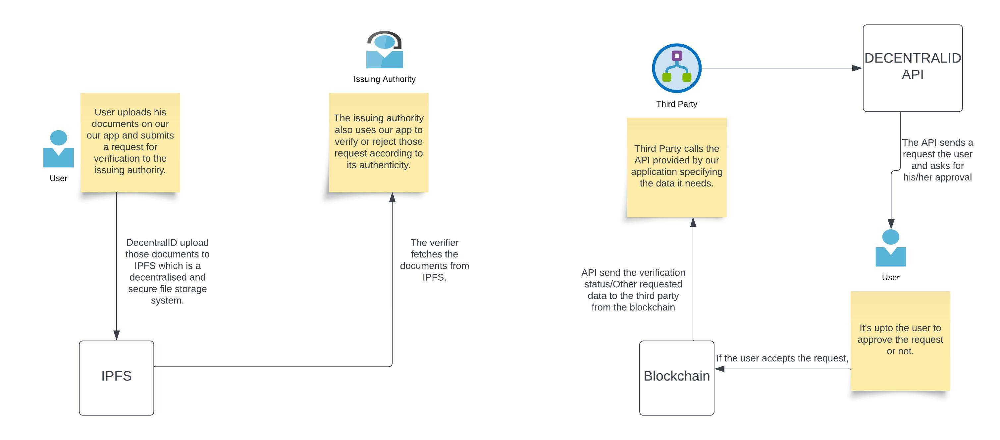
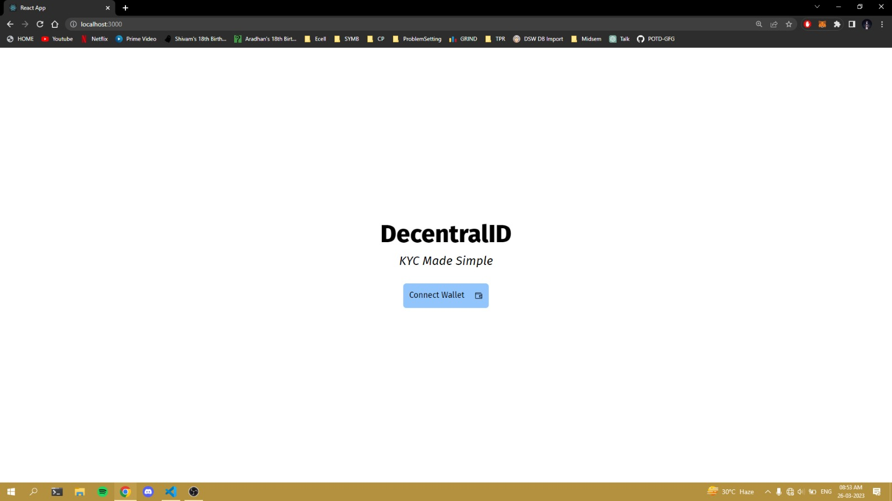
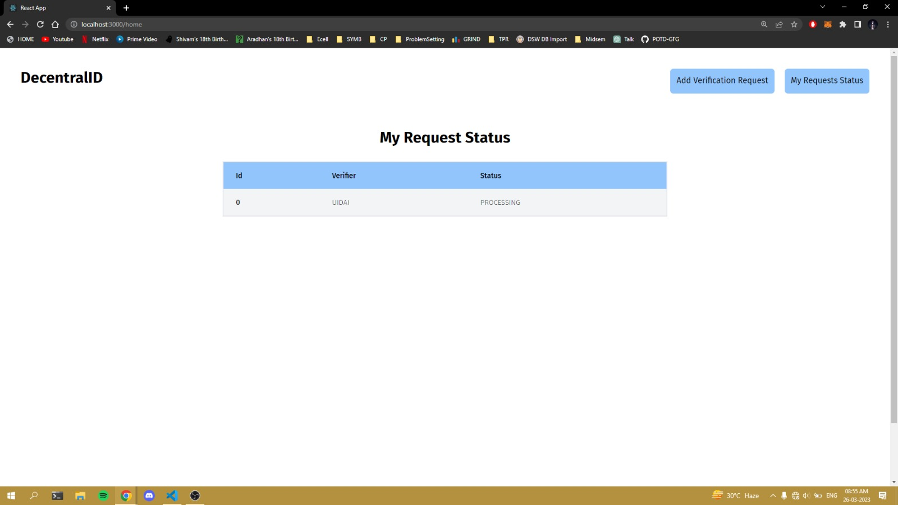
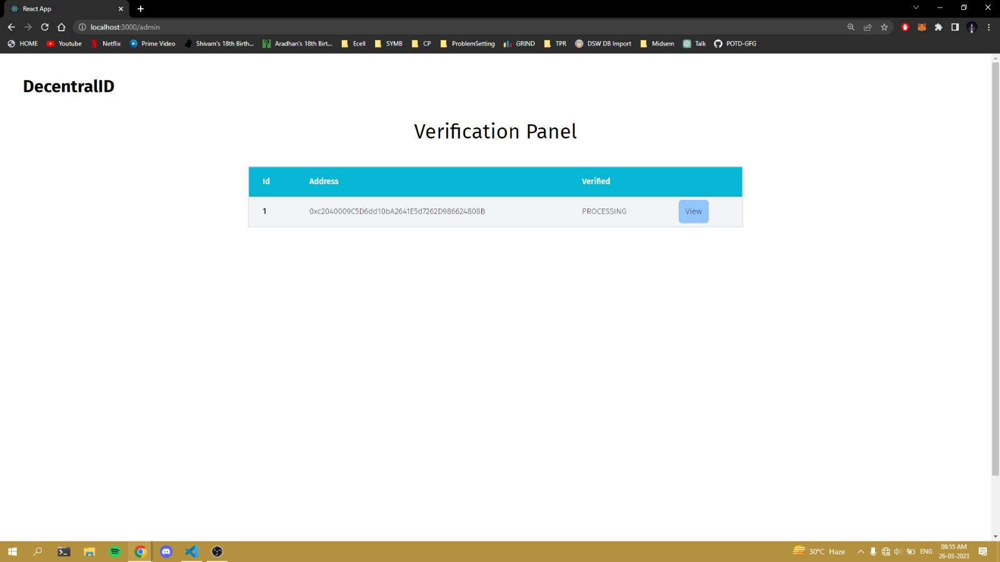
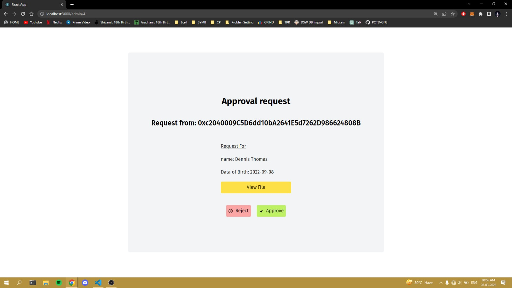
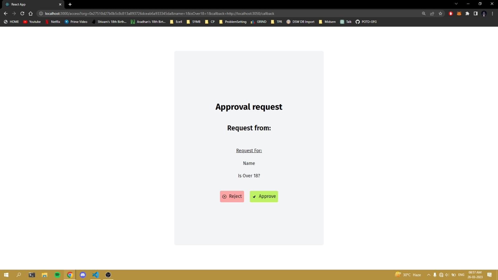

# DecentralID

This project was developed by us, **Team ECMAniacs**, as a submission for [Hack36 6.0](https://www.hack36.com/)

*UPDATE* - We went on to win 1st position in this hackathon, our [Devfolio Project Link](https://devfolio.co/projects/decentralid-a6db) 

## Resources
- [PPT](https://docs.google.com/presentation/d/1fDOJagdUc-62sfzt8al91WkodRhC2Zv7d_QZ0y-s-NQ/edit?usp=sharing)
- [Video Demo](https://youtu.be/zDhHoVL1Ed8)

## Team ECMAniacs
- [Aqib Suhail](https://github.com/geeqib23)
- [Dennis Thomas](https://github.com/DNA5769)
- [Kushagra Sharma](https://github.com/randomkush)
- [Akash Kandasamy](https://github.com/akash-kd)

---

Through this project, we aim to build a decentralized identity verification service that addresses the issues of data breach and identity theft.

## Why We Built This
There are many websites and services out there which require us to submit our official documents online to them for purposes such as ID Verification, Age Verification and so on.
Just to prove their identity, users are forced to give away their personal documents which contain a lot more personal data than the user may want to share. Also, there are great chances of the user data being compromised due to data breaches and data theft. This leads to problems of privacy, security, and trust.

## How we solve the problem
Through this project, we aim to build a decentralized identity verification service that addresses these issues. It does so by eliminating the need of uploading documents onto these third-party websites and providing users with full control over the data that they want to share. Our system should allow users to verify their identity, while preserving their privacy and security.
The documents of the user are shared only to the issuing authority for verification (which already has it) and no one else.
Third party apps can use our API service to verify the user and also it saves them work because we do the verification for them.
So multiple goals are achieved through our project.

## Technologies Used and Working

1. Smart Contracts - We wrote our smart contracts in Solidity. We used Hardhat to run them on a development network and test them and finally deployed them on the Blockchain. We use these contracts to make implement logic and store data through ETH transactions.
2. Frontend - We used ReactJS for UI and TailwindCSS for styling.
3. Metamask - MetaMask is a software cryptocurrency wallet used to interact with the Ethereum blockchain. We used its browser extension to access the Ethereum wallet and interact with our application.
4. IPFS - IPFS or InterPlanetary File System, is a peer-to-peer distributed file system that allows users to store and access files in a decentralized manner. Instead of relying on a central server, IPFS uses a distributed network of nodes to store and share files. We used IPFS to store user’s documents so the verifier can access them later and check whether it’s authentic or not. Only the user and the verifier of the document can access the document from IPFS.

## Demo

## Challenges We Faced
1. Learning Solidity and IPFS : All of us were not too much familiar with solidity and we've learned it on the go as we made this project.
2. Coming up with secure and efficient smart contracs. 
3. Identity Crisis
